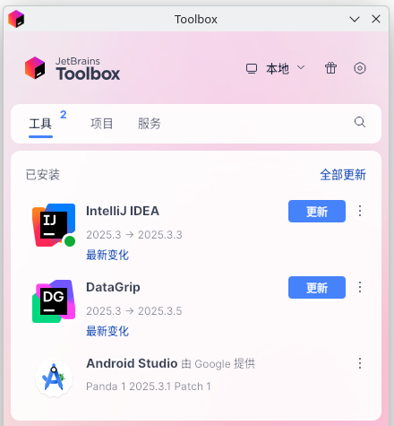
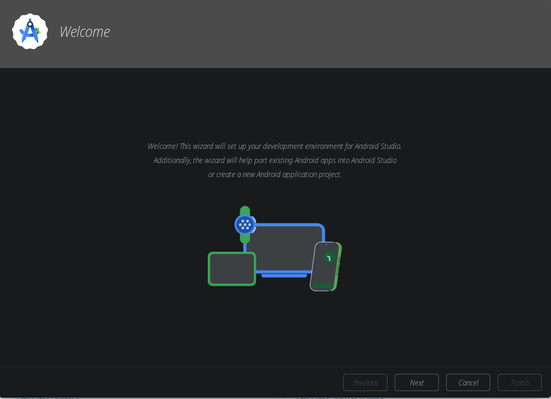
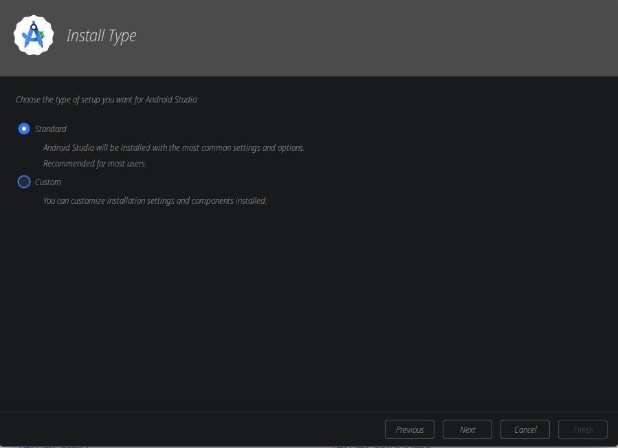
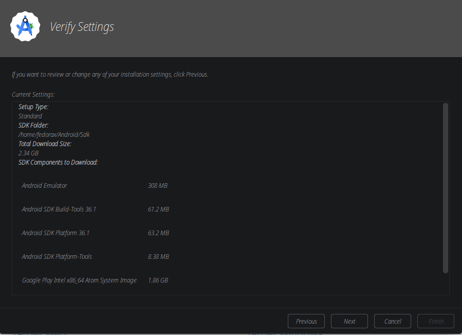
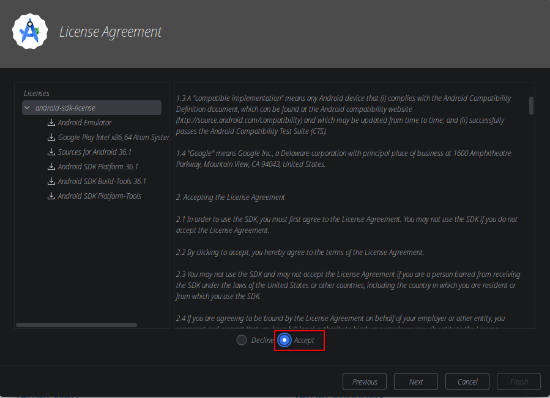
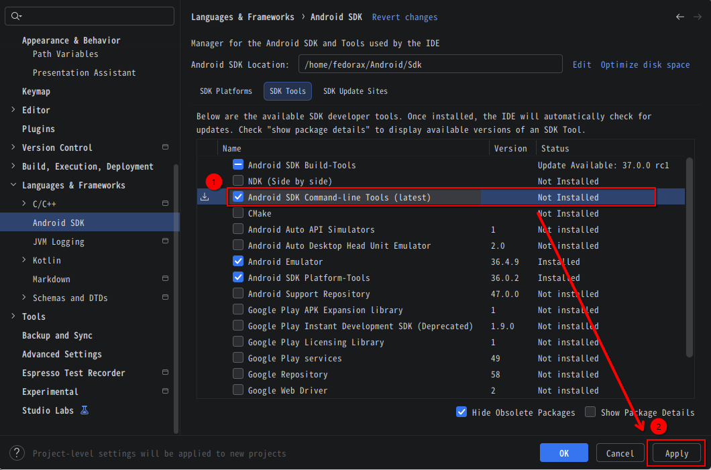
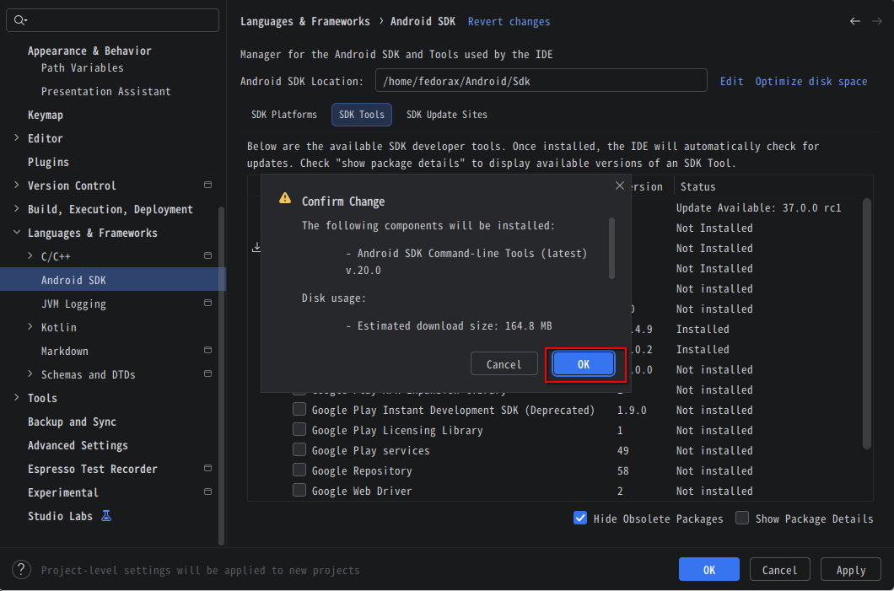

category:: Software
type:: 开发🔨

- # 安装&初始化
	- ## 安装
		- ### 通过[[Jetbrains Toolbox]]安装
		  id:: 835680f5-845e-4fd3-86a6-f6fe8be816de
			- 
	- ## 初始化配置
		- ### 安装基础拓展
		  collapsed:: true
			- 
			- {:height 528, :width 718}
			- 
			- 
		- ### 安装命令行工具
		  collapsed:: true
			- 
			- {:height 483, :width 718}
- # 接下来
	- [[]]