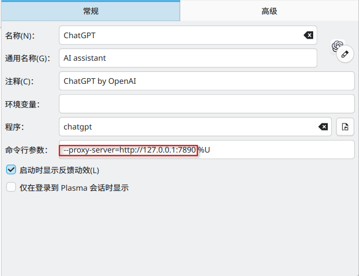

category:: Software
website:: [官网](https://chatgpt.com/zh-Hans-CN/overview/)

- # 配置
	- ## 在Linux环境为ChatGPT配置代理
		- > **注意：**在ChatGPT与CodeX客户端合并后，codex服务仍然作为独立Rsut子程序运行，只按照[[Electron]]配置ChatGPT应用代理的方式无法作用在应用中的CodeX程序中，需要同时确认是否配置 ((6a9c2c86-1169-4dff-b1d7-2602788d00ad))
		- ChatGPT客户端为 [[Electron]] 程序，采用 [[Electron]] / [[Chromium]] 的代理配置方式即可，[[.desktop]]配置参考如下
			- ```shell
			  Exec=chatgpt --proxy-server=http://127.0.0.1:7890 %U
			  ```
			- 或者
			- ```shell
			  Exec=env HTTP_PROXY=http://127.0.0.1:7890 HTTPS_PROXY=http://127.0.0.1:7890 chatgpt --proxy-server=http://127.0.0.1:7890 %U
			  ```
				- **KDE图形化配置参考**（左侧箭头展开）
				  collapsed:: true
					- 将`--proxy-server=http://127.0.0.1:7890 `复制在`%U`前面，注意他们中间有一个空格。
					- 