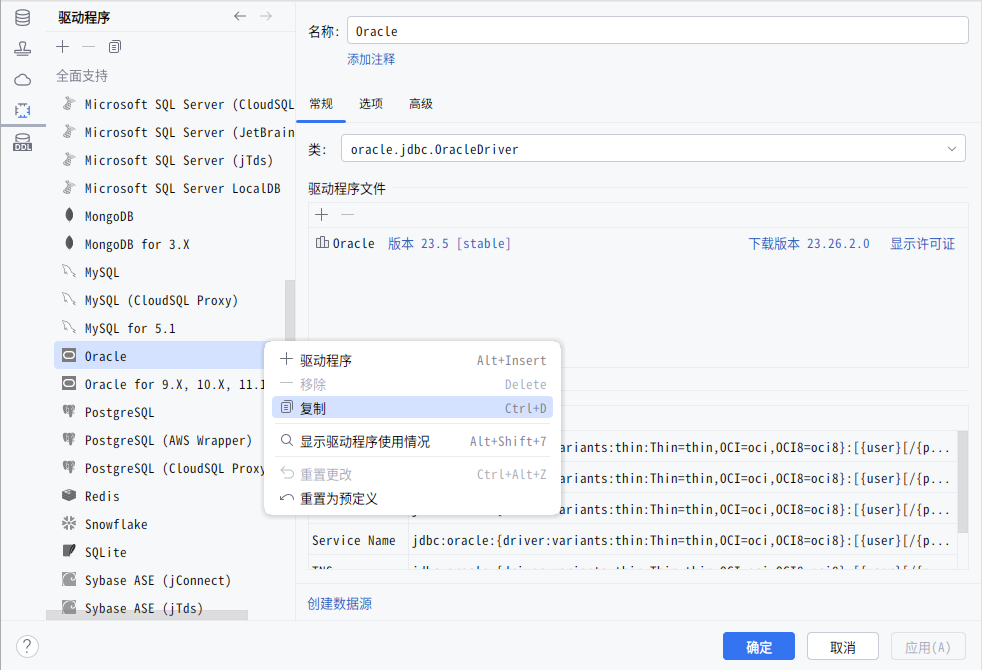
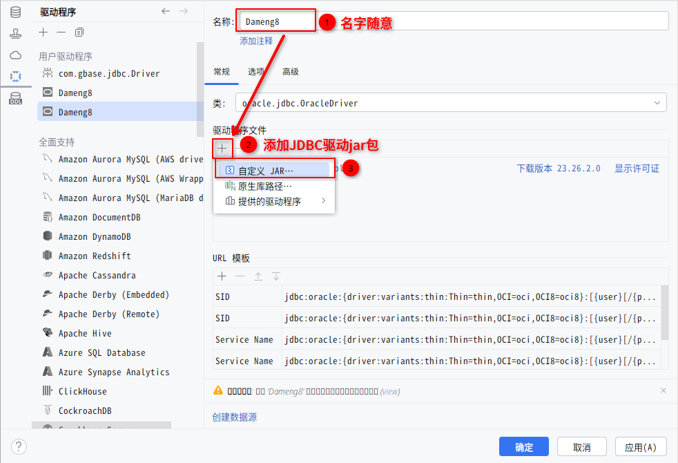
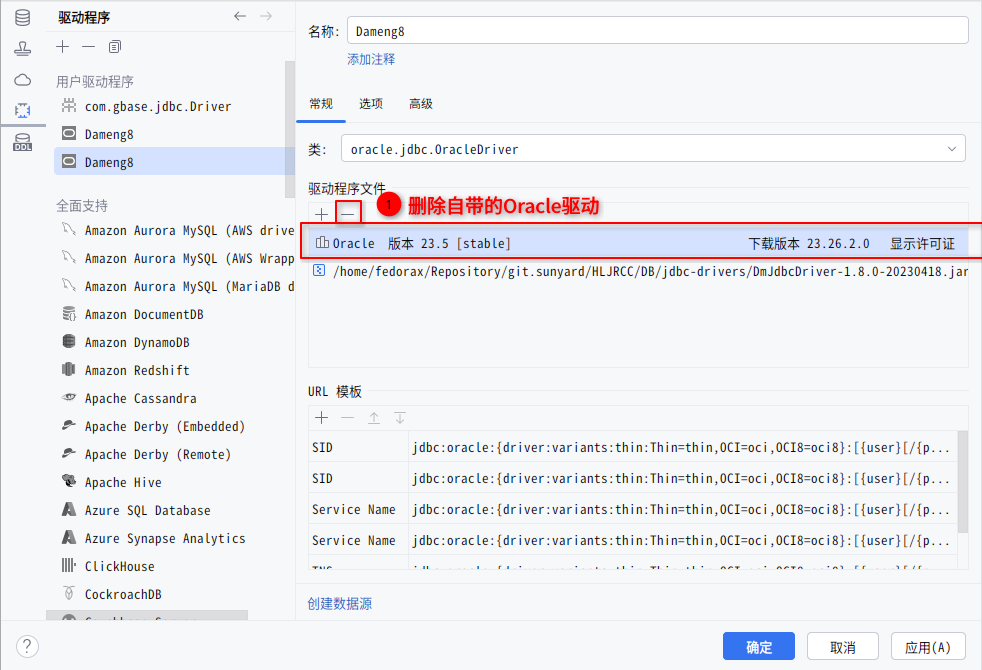
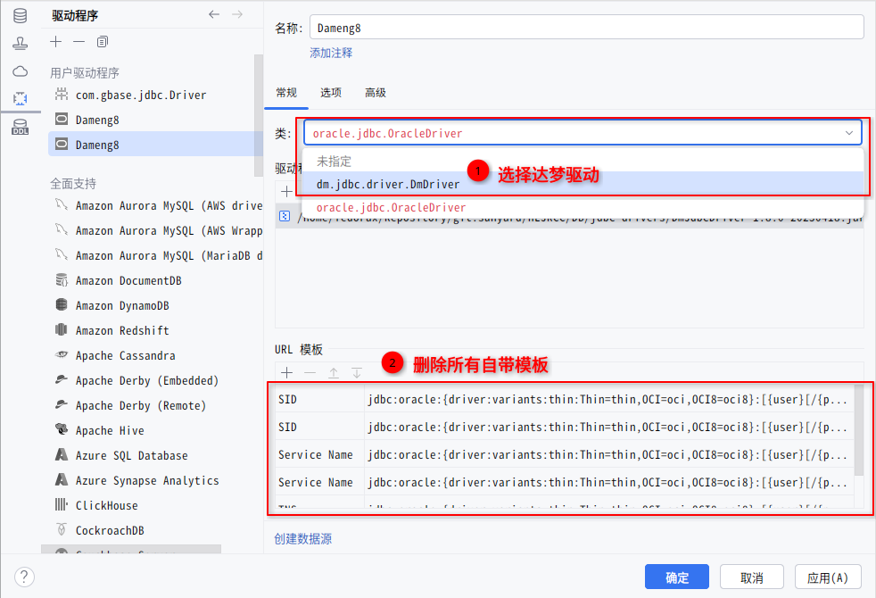
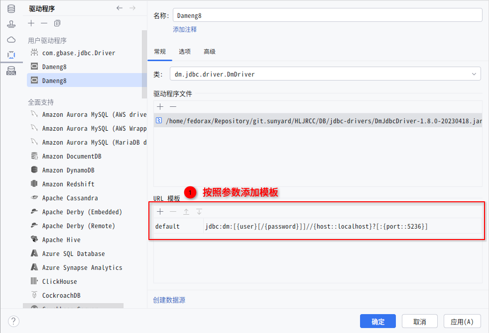

- 本指南将帮助你使用[[Datagrip]]使用[[JDBC]]的方式连接到[[达梦]]数据库 。
- # 配置驱动程序
	- 选择并复制Oracle驱动配置
		- 
		- > 个人使用下来，复制Oracle的驱动可以获得最佳的适配特性。
	- 修改复制的配置为达梦的专属配置
		- 
		- 
		- 
		- 
		- default数据源配置：`jdbc:dm:[{user}[/{password}]]//{host::localhost}?[:{port::5236}]`