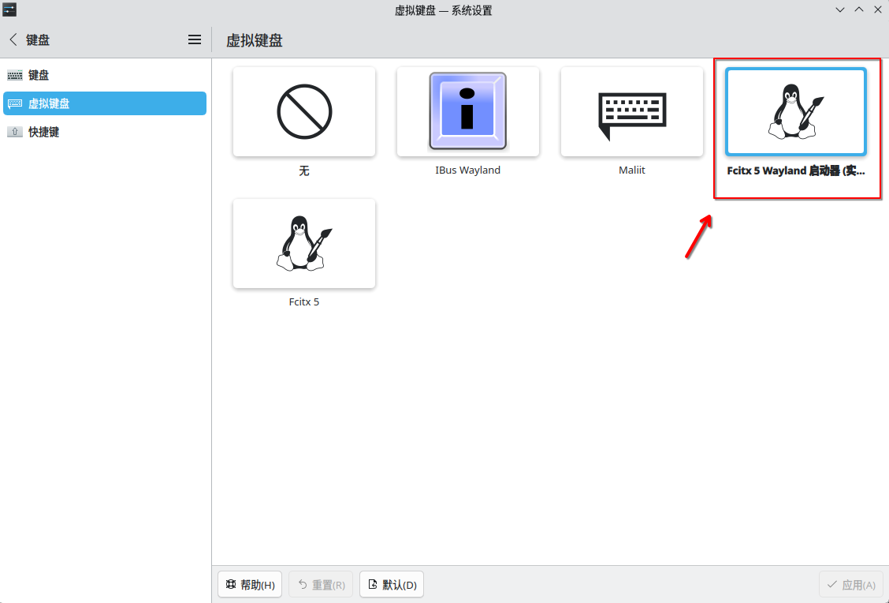
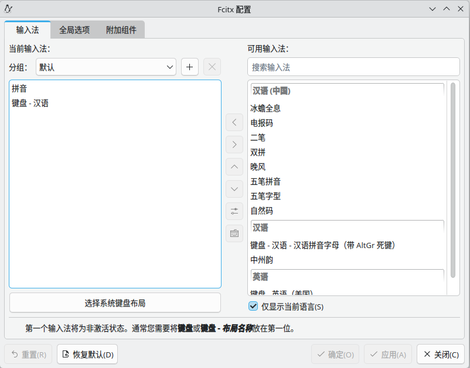
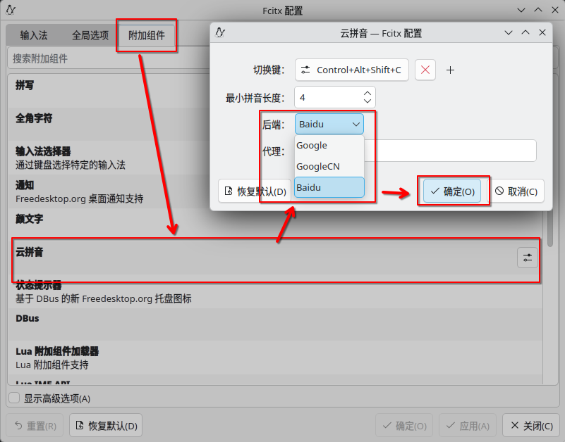

category:: Software
type:: 系统⚙️
alias:: Fcitx5

- # 安装&初始化
	- ## 安装
		- ### [[Fedora]] / [[RHEL]] - [[yum]] / [[dnf]]
			- ```shell
			  # 使用 yum 安装
			  yum install fcitx5 fcitx5-chinese-addons fcitx5-configtool fcitx5-gtk fcitx5-lua fcitx5-qt fcitx5-qt5 fcitx5-qt6  
			  
			  # 使用 dnf 安装
			  dnf install fcitx5 fcitx5-chinese-addons fcitx5-configtool fcitx5-gtk fcitx5-lua fcitx5-qt fcitx5-qt5 fcitx5-qt6  
			  ```
	- ## 初始化配置
		- ### 将输入法修改为Fcitx5
			- #### KDE-Wayland环境
				- 打开**系统设置**应用，导航到菜单**输入和输出->键盘->虚拟键盘**，选择**Fcitx 5 Wayland启动器（实验性）**。
				- 
		- ### 为X11配置环境变量
			- 将如下配置加入 `/etc/environment`
			- ```
			  GTK_IM_MODULE=fcitx
			  QT_IM_MODULE=fcitx
			  XMODIFIERS=@im=fcitx
			  ```
			- 注销用户，并重新登录。
		- ### 配置中文输入法
			- 进入Fcitx配置页面，在输入法选项卡，将拼音添加到左侧，并移动到最顶端。
			- 
		- ### 启用云拼音
			- 