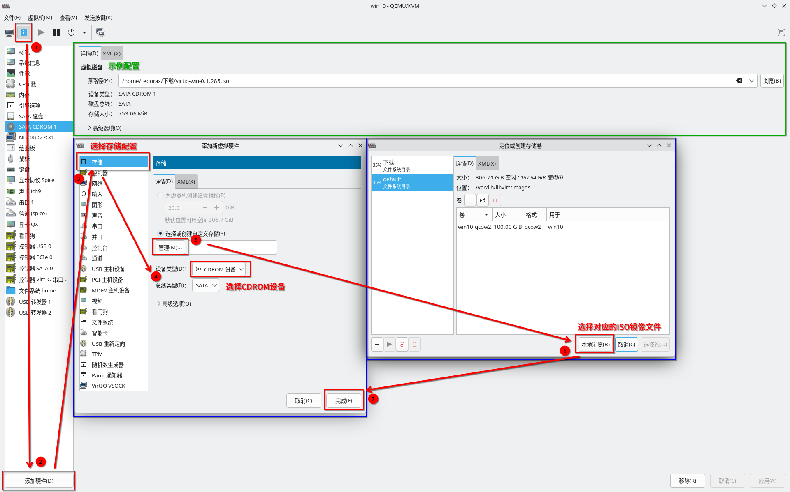

website:: https://virt-manager.org/
alias:: virt-manager

- ## 下载、挂载并安装virtio驱动程序
  id:: 69a78093-9451-4f69-9bc6-2fbb736b8640
	- 前往[[virtio-win]]对应的镜像地址下载**virtio-win**驱动。
	- 配置挂载驱动盘
		- 
	- 开启虚拟机后，进入`virtio-win`的**CD-ROM驱动器**
	- 运行**virtio-win-guest-tools**，并完成**完整安装(推荐)**