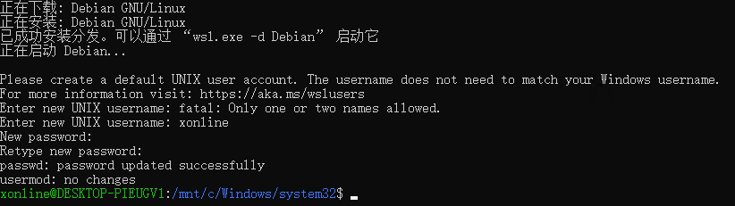
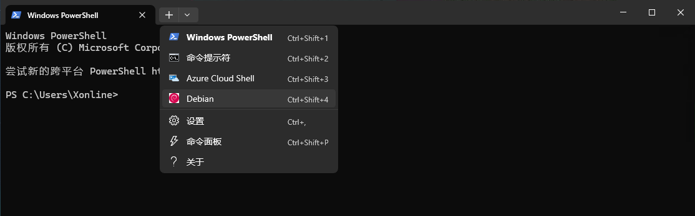

alias:: WSL
category:: Software
type:: 系统⚙️

- # 安装&初始化
  id:: fee56816-f3e2-49d8-bf50-7bdf7732198b
	- ## 安装
		- ### 查询可用子系统
			- ```powershell
			  wsl --list --online
			  ```
		- ### 安装子系统
			- > 如果不使用 `-d` 参数指定，默认安装 [[Ubuntu]] 版本子系统
			- ```powershell
			  # 不指定版本
			  wsl install
			  
			  # 指定版本
			  wsl install -d <osName>
			  # e.g. wsl install -d debian
			  ```
		- ### 后续操作
			- 在执行安装命令后执行一些步骤后需要重启电脑才能继续安装。而后初始化页面需要设置用户名与密码。
			- 
			-
- # 使用
	- > 推荐使用 [[Windows Terminal]] 中使用WSL子系统功能，以获得更现代的使用体验。
	  
	-