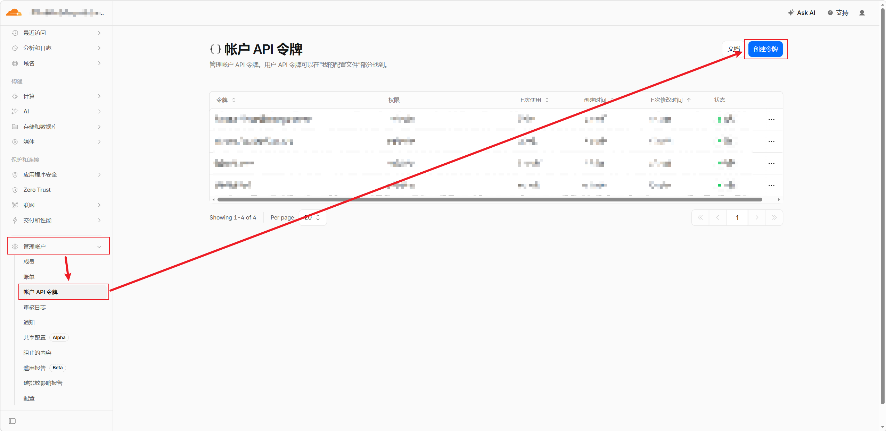
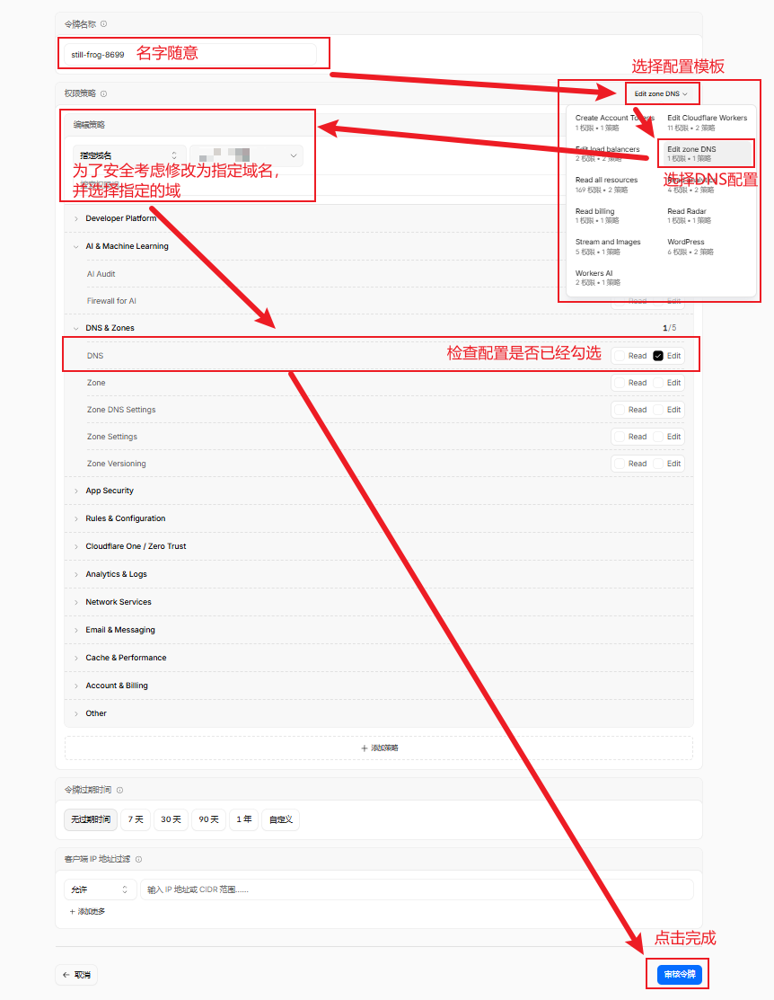
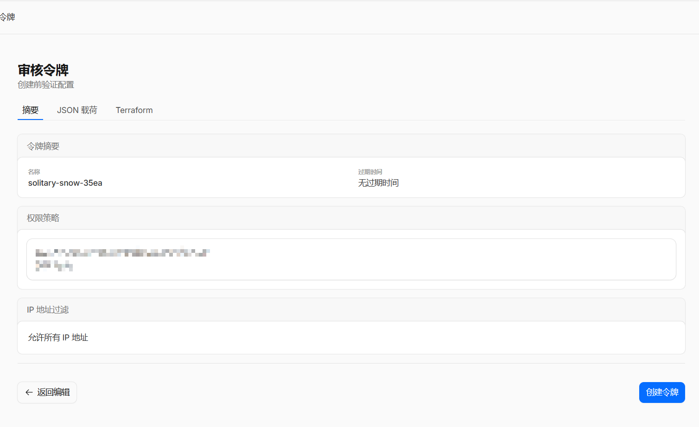
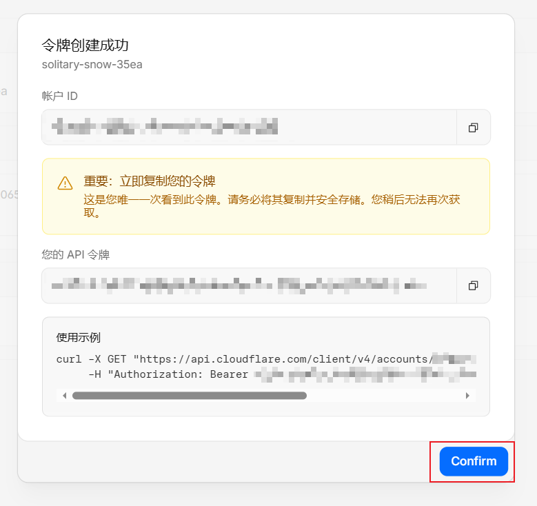
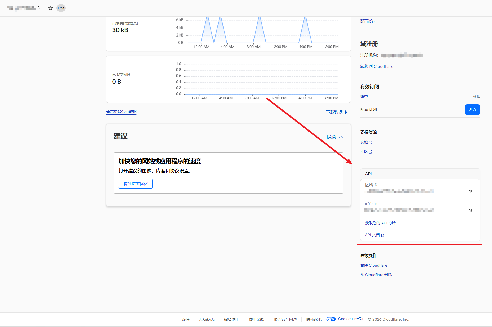

category:: Notes
tags:: acme,nginx,ssl

- 本文介绍了如何手动为托管于Cloudflare的域名申请**[[Let’s Encrypt]]**颁发的SSL证书用于安全的从互联网访问一个离线环境的代理服务器。
- > 对于拥有互联网访问的服务器，推荐通过[[Nginx Proxy Manager]]或[[Caddy]]来运行代理服务以享受自动续签的[[Let’s Encrypt]]证书。
- 下面让我们开始吧！
- ## 克隆项目并配置
	- ```shell
	  git clone https://gitee.com/neilpang/acme.sh.git
	  cd acme.sh/
	  sh ./acme.sh --install -m <E-Mail>
	  ```
		- **E-Mail:**用户邮箱
- ## 获取并记录Cloudflare信息
	- ### 创建令牌并记录令牌ID
		- 前往**管理账户->账户API令牌->页面创建一个API令牌**
			- 
		- 选择**令牌管理的域与接口权限**
			- 
		- 审核令牌权限
			- 
		- 记录API令牌ID
			- 
			- 记录**API令牌(轮转前唯一一次查看机会)**。
	- ### 查找并记录账户ID与域ID
		- 进入到需要申请SSL证书的域主页，在**主页面右侧下方找到API栏位**，记录**区域ID**与**账户ID**。
			- 
- ## 申请证书
	- 继续回到可以联网的主机进行操作
		- ```shell
		  # 1. 设置 Cloudflare 令牌环境变量
		  export CF_Token=""
		  
		  # CF_Zone_ID、CF_Account_ID在对应域的主页下
		  export CF_Zone_ID=""
		  export CF_Account_ID=""
		  
		  # 2. 申请证书（包含根域名和所有二级子域名）
		  ~/.acme.sh/acme.sh --issue --dns dns_cf -d <主域名> -d *.sunyard.team
		  ```
			- **CF_Token：**API令牌ID
			- **CF_Zone_ID：**域ID
			- **CF_Account_ID：**账户ID
			- **主域名：**DNS解析的主域名
			- **泛域名：***.xon.ink