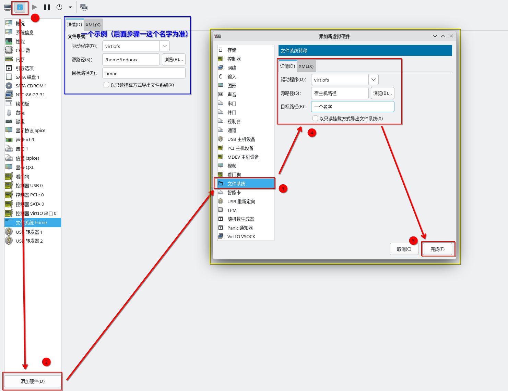
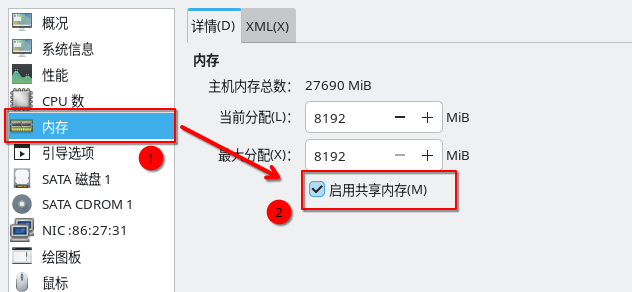
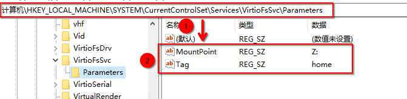

category:: Notes

- # 🟢前置条件
	- ((69a78093-9451-4f69-9bc6-2fbb736b8640))
- # 🎈开始
- ## 一、添加虚拟机硬件
	- 选择对应的Windows虚拟机，选择“显示虚拟硬件详情”->“添加硬件”->选择"文件系统"->驱动程序选择`virtiofs`并填写对应的**源路径**与**目标路径**，然后点击保存。
	- 
	- > 后续配置均已`home`作为示例
	- 选择**内存**->勾选**启用共享内存**。
	- 
- ## 二、在Windows虚拟机中安装并配置VirtioFS
	- > 在此步骤开始之前需要额外完成 [[virtio-win]]驱动的安装
	- ### 开启**VirtIO-FS**原生服务
		- 按下 `Win + R`，输入 `services.msc`。
		- 寻找名为 **Virtio-FS Service** 的项，右键点击“属性”，确保启动类型是“**自动**”。
		- > 该服务通过读取注册表参数来自动挂载服务，具体配置在注册表中，请继续往下看
	- ### 配置注册表
		- #### 方法一、命令行方式
			- 使用**管理员**运行 `powershell`
			- ```powershell
			  $registryPath = "HKLM:\SYSTEM\CurrentControlSet\Services\VirtioFsSvc\Parameters"
			  if (!(Test-Path $registryPath)) {
			      New-Item -Path $registryPath -Force
			  }
			  New-ItemProperty -Path $registryPath -Name "MountPoint" -Value "Z:" -PropertyType String -Force
			  New-ItemProperty -Path $registryPath -Name "Tag" -Value "home" -PropertyType String -Force
			  ```
				- **MountPoint**: 挂载盘符，示例为 `Z:`
				- **Tag**: 宿主机中配置的目标路径，示例为 `home`
		- #### 方法二、手动配置
			- 
			- > 默认**VirtioFsSvc**下为空，`Parameters`需要手动添加
	- ### 🔄重启计算机
		- 重启计算机，然后在资源管理器观察是否出现目标盘符，并确认是否可以访问。