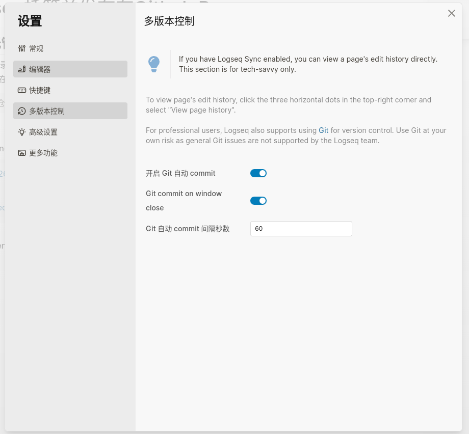
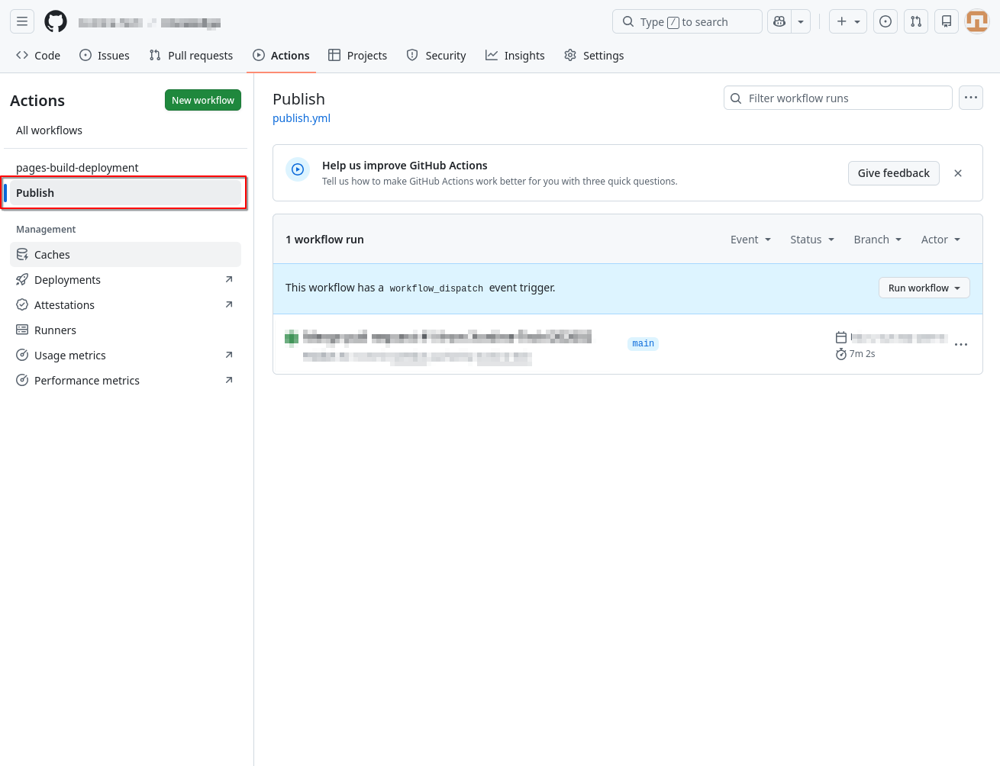
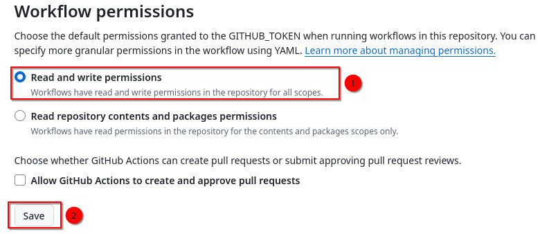
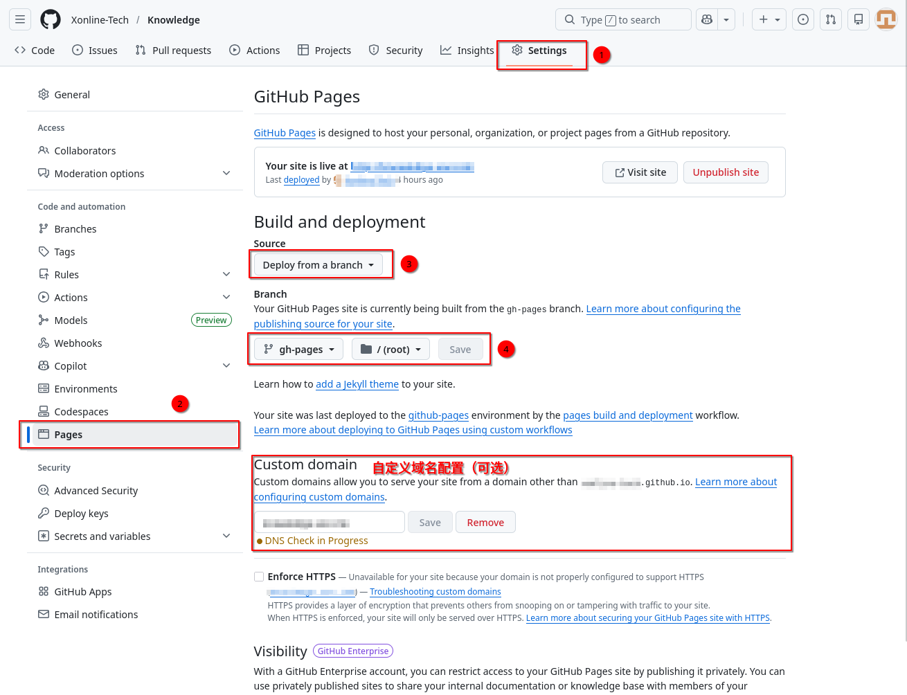
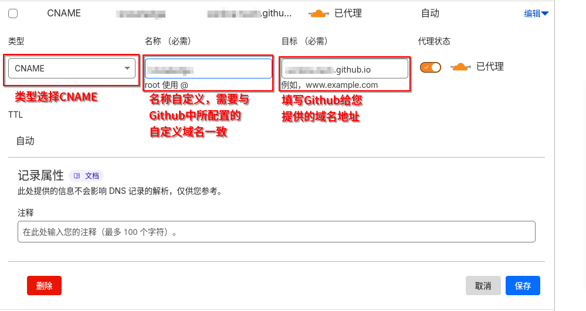

category:: Notes
tags:: Logseq,Github

- ## 将笔记托管到Github
  collapsed:: true
	- > 该步骤需要电脑中拥有git客户端或Git管理工具
	- **在笔记目录初始化git仓库（推荐）**
	  logseq.order-list-type:: number
		- **方式一：开启Logeq图谱的多版本控制功能，自动初始化Git仓库**
			- 可以在Logseq中打开上传的图谱，点击左上角菜单按钮，然后打开设置。选择多版本控制选项页，勾选**开启Git自动commit**后，应该会出现填写用户名与邮箱的弹出框，填写完成后会自动创建Git仓库。
			- 
		- **方式二：使用命令行或GIt可视化工具手动创建**
			- > 这种方式无法获取Logseq的自动提交功能，需要手动commit
	- **初始化Github仓库，并push笔记仓库**
	  logseq.order-list-type:: number
		-
- ## 配置Github仓库
	- > 只有公开仓库才能享受免费的Github Pages发布功能
	- ### 创建Action配置
		- 在Git仓库中创建文件夹 `.github/workflows`
		  logseq.order-list-type:: number
			- ```shell
			  mkdir ./.github/workflows
			  ```
		- 创建配置文件 `publish.yml`
		  logseq.order-list-type:: number
			- ```yaml
			  name: Publish
			  
			  on:
			    push:
			      branches: [ main ]
			    # Allows you to run this workflow manually from the Actions tab
			    workflow_dispatch:
			  
			  jobs:
			    build:
			      runs-on: ubuntu-latest
			  
			      steps:
			        - uses: actions/checkout@v3
			  
			        - name: Logseq Publish
			          uses: logseq/publish-spa@main
			          with:
			            output-directory: www
			            accent-color: indigo
			  
			        - name: Add .nojekyll file
			          run: touch www/.nojekyll
			  
			        - name: Deploy to gh-pages
			          uses: JamesIves/github-pages-deploy-action@v4.4.1
			          with:
			            branch: gh-pages
			            folder: www
			            clean: true
			            clean-exclude: |
			              CNAME
			              .nojekyll
			  ```
			- > 该配置只会检测`on.push.branchs`所配置的分支变化触发**Action**，你可以修改该配置为你所期望的分支，或者将主分支名称修改为`main`
		- 将修改**Push**到仓库主分支，你将可以在仓库Action配置页面看到您所发布的配置。
		  logseq.order-list-type:: number
			- 
	- ### Action权限配置
		- 进入菜单 **Settings -> Actions->General->Workflow permissions**，选择**Read and write permissions**后点击**Save**保存。
		- 
	- ### Github Pages配置
		- > 在配置Github Pages页面之前，你需要先通过**Push**或**Pull Request**一次**Action**所配置的分支，或手动运行一次。让其创建`gh-pages`分支
		- 在Github仓库的**Settings->Pages**页面按照步骤进行配置
		  logseq.order-list-type:: number
			- 
		- 当你配置好以后，Github会给你一个生成的域名供你访问浏览，如果想要进一步使用自己的域名进行访问可以在**Custom domain**中配置自己的域名，并前往DNS服务提供商配置
		  logseq.order-list-type:: number
			- > 以下是一个在[[Cloudflare]]中的配置参考
			- 